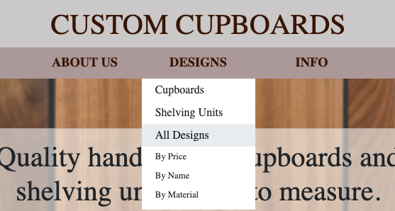
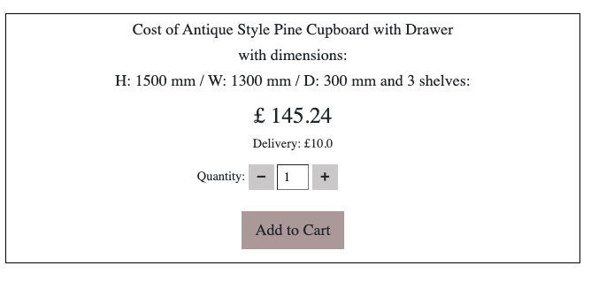
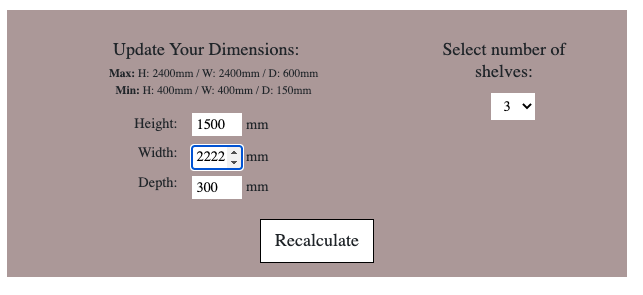
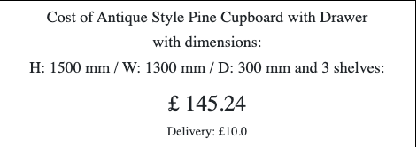
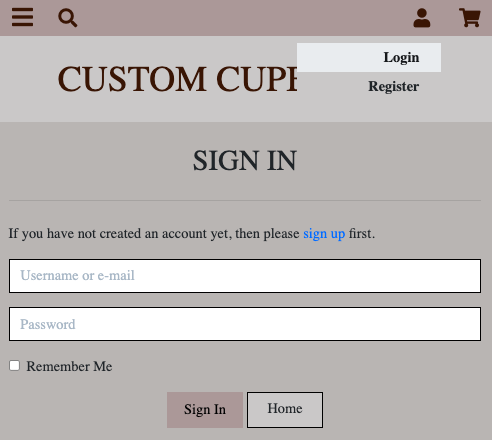
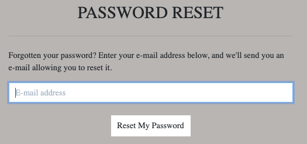
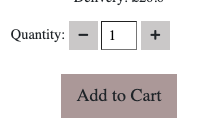
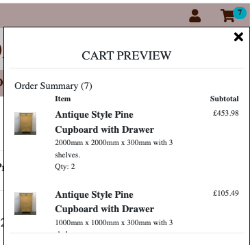
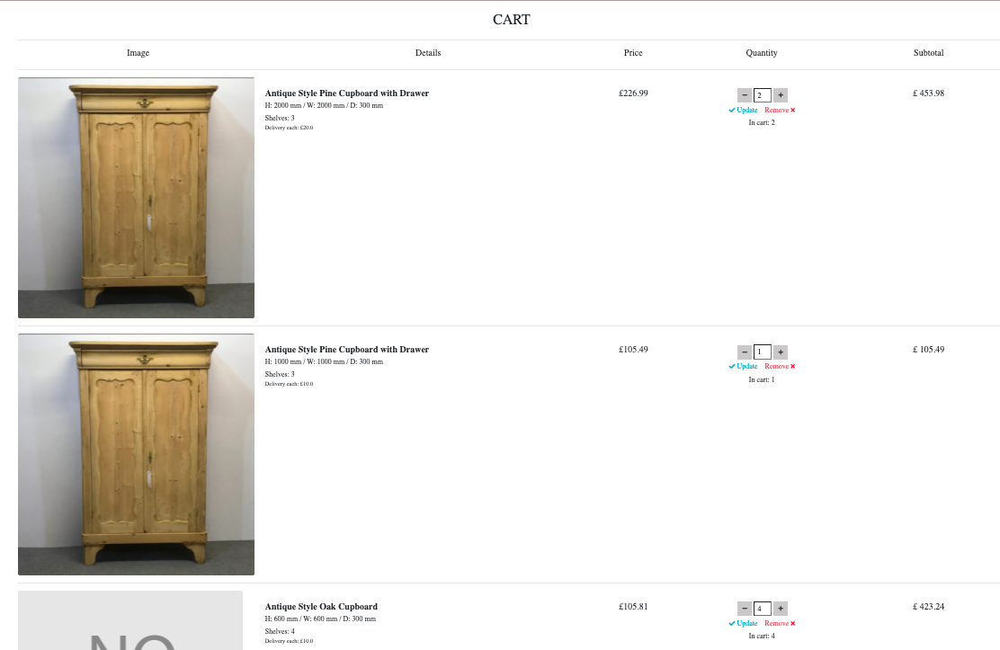

# Custom Cupboards

Made for Code Institute's Fullstack Software Development Diploma Milestone 4 project. 

A fictional e-commerce website, built on the Django framework, supplying made-to-measure cupboards and shelving units.  

Users have the oportunity to select a design, enter their desired dimensions and shelves and receive an on the spot quote to buy that unit and have it delivered to them.  They can then opt to add it to a shopping cart and proceed to checkout and purchase it if they wish.  

A payment system exists using Stripe in test mode which takes mock payments.  Purchasers then receive a confirmation email for their purchase.  

Registration and login functionality exits using the pre-built Allauth package which enables users to save their delivery information for future purchases and save their order history for later review.

The site aims to be logical to navigate and provide users with feedback confirming whether or not their interactions with the site have been successful.

See the site: [Custom Cupboards](http://custom-cupboards.herokuapp.com/)

Login details for admin are:

USERNAME: super100

PASSWORD: rubberplant

## UX

### **User Stories**

### **Strategy**

To create a website that meets the needs of the user stories and has potential to be developed into an actual business in the real world in the future.

### **Scope**

Features to include:
* A navbar, collapsible for small screens

* Functionality to search for a design by search term apprearing in the name or description.

* Functionality to browse through designs, filter them by type and sort them by name, price or material.

* Custom cost calculator enabling users to select a design then enter their own dimensions and shelves to receive a quote for the cost and the postage.

* Functioality to alter their chosen dimensions and recalculate the cost and postage.

* Cart functionality where users can group together their selections for purchase, view the total cost of items and the total postage cost and alter the quantity of items for purchase.  While it is likely that most users will be only purchasing these items one at a time, there is functionality for purchasing multiple at one time if they wish. 

* Test payment functionality powered by Stripe.

* Login and register functionality enabling users to save their delivery information for further use and their order details for later review.

* Functionality for a user to view their saved delivery information, make changes to it and view their order history.

* Functionality for a super user to access restricted areas of the website and add, edit or delete designs and materials.

### **Structure**

* The app will be responsive on all screen sizes

* The top navigation will have a search icon which will expand a search bar as a dropdown, a user icon giving links to log in or register for users not logged in or to view profile or log out for those logged in.  Additionally on screens medium and below there will be a bars icon to open the a sidenav which will show the main navigation links.

* The cart icon in the top navigation will show a badge if there are any items in the cart and the total cart items count and, on large screens, will open a cart preview which shows a summary of items in the cart, a button to go to the cart page and a button to go straight to the checkout page.

* The main navigation will provide links to all pages in the site grouped by subject (About, Designs, Info plus Management visible to superusers).  This will be a bar on screen sizes medium and above and in a collapsible side nav for smaller screens.

* To give maximum screen to content, the navbar will scroll with content and not be fixed.

* The home page will give users an overall impression of the site, an introduction to what is available and a large call to action button inviting them to view all available designs.  In addition check icons indicating that they can buy online, payments are secure, purchases are guaranteed and products are handmade in the UK.

* The designs page will list the designs in the database. There will be a photo of each design, it's name, description, example price calculated for standard dimensions and given for price comparison between designs aand a large button to select this design. Users will have the option to filter the designs by type and sort them by name, price or material.  As it may be a long page there is a link at the bottom to return to the top of the page.

* For users logged in as superusers there will be additional buttons with each design to edit or delete that design.  The edit button will lead to a separate page with a form preloaded with the field values in the database for that design where they can be edited and a button to save the new values.  It will also show a small image preview of the current image for the design which can be updated.

* The designs page will lead to a details page for each design with a form for users to enter their desired dimensions and shelves and then request a cost calculation.

* After requesting a cost calculation users will see a page almost indistingushable from the details page but for the fact that the 'Calculate Price" button will now read 'Recalculate' and instead of being invited to 'Enter' their required dimensions they are invited to 'Update' them.  Plus additionally there will be a section at the bottom showing their calculated cost, the postage for that unit, a quantity selector and an 'Add to Cart' button.

* The Cart page will show all the units of particular dimensions, shelves and design that have been selected for purchase and in what quantity.  Also the postage per item and the subtotal of that quantity of that item.
here will be the option to alter the quantity, delete the item altogether or retun to the calculation page where they can recalculate the cost with different dimensions.   There not yet exists the option to alter the dimensions of that item: currently the unit with new dimensions needs to be also added and the previous one deleted. 
The total cost for items, the total postage cost and the grand total sum of those will be clearly shown in a box unter the list of items in the cart.
There will be a large button to proceed to secure checkout plus a link at the bottom of the page to return to the designs page.
The checkout page requires all form fields for delivery and payment to be correctly entered and then there is a final small alert of what their card will be charged before they press complete order.  Alternatively they have a button to 'Adjust Cart' which leads back to the cart page.
There will also be a cart summary section on this page.

* After purchase a user will be presented with a checkout success page informing them that a confirmation email has been sent to the email address they provided and a summary giving all the details of their order.  There is a link to return to the designs page at the bottom.

* The About link in the navigation will drop down to links to a 'What we do' page and a 'Contact' page.  In the future it is hoped the contact page will be a functioning contact form but currently it just gives business contact details.  Both pages are very similar in appearance, using the same layout and background image, and there will be an indicator in the top left showing the user where they are in the site and a link to go to the other page in the section.  There will be a link back to the home page.

* The Info link in the navigation will provide dropdown links to Pricing, Delivery, Assembly and Returns information pages.
These will all be the same in structure as the about links and very look very similar to each other, all using the same background image.  Again there will be an indicator in the top left showing location in the site and links to move between the pages in this section and again a ling back to the home page at the bottom.

* For users logged in as superusers there will be an additional nav link with drop down options to Add a Design or go to a Materials page.  

* The Add Design page will enable users to fillout a form, giving all the required field values to add a design to the store database, a link to upload an image for the design, a button to submit the form and a button to cancel if they change their mind.  

* The materials page will show a list of the materials currently available and their costs per sqm with buttons to either edit the material or delete the material.  Therw will also be a form to add a new material, with inputs for the required field values and a submit button.

* The edit material button will lead to a separate page with a form similar to the add a material button but preloaded with the current values for that material which are editable.

* There will be a reponsive footer at the bottom of the content on every page giving quick links to Designs, Delivery and Returns pages (likely to be the most essential information), social media links to Facebook and Youtube, business contact details, copyright information, website by and a trust seal image provided by Stripe, guaranteeing secure payments.

* For any user interaction with the site, toast messages appear informing a user of the outcome of their action.  These appear with the screen overlayed with a semi transparent grey background and in the center of the screen with different colours for Success (green), Error (red), Warning (yellow) and Info (blue).   The warning message is infact only used when a super user is about to delete a design or material and incorporates a button to either confirm delete or cancel.

### **Skeleton**

The wireframes can be viewed here:

- [Homepage wireframes](media/readme/home-wireframes.png)

- [Designs page wireframes](media/readme/designs-wireframes.png)

- [Designs page wireframes](media/readme/designs-wireframes.png)

- [Designs page wireframes](media/readme/designs-wireframes.png)

- [Designs page wireframes](media/readme/designs-wireframes.png)

- [Designs page wireframes](media/readme/designs-wireframes.png)

- [Designs page wireframes](media/readme/designs-wireframes.png)

- [Designs page wireframes](media/readme/designs-wireframes.png)

- [Designs page wireframes](media/readme/designs-wireframes.png)

- [Designs page wireframes](media/readme/designs-wireframes.png)

- [Designs page wireframes](media/readme/designs-wireframes.png)

- [Designs page wireframes](media/readme/designs-wireframes.png)

### **Surface**

* Colours:
    * Two main theme colours have been used' 'light-theme-color' (rgb(202, 200, 200)) and 'red-theme-color' (rgb(168, 153, 153)).  These were chosen to be neutal and unobtrusive yet stylish and attractive, indicating the same promised of the cupboards.  Both colours have a slight reddish undertone intended to give some warmth and be reminiscent of the wamrth of natural wood.
    
* Background:
    * Either a white background for commerce pages or a grey background for login and registration pages and for superuser management pages is used.  
    The white background is used to be simple, clan and not distract from the content.
    The grey background was discovered by at first previewing the login templates with the overlay from the toast messages behind and it was decided that this looked nice and added some interest to the otherwise simple pages.  It has however been lightened slightly as a background although in order to keep the close to the original colour the reduced opacity has been left.  The code for this colour is rgba(148, 143, 140, 0.664).  It has also been used as a background for the Management pages to add or edit a design or material to differentiate these from the main site commerce pages.

* Text:
    * The Google Font "Slabo+27" has been used throughout the site as it was thought to look attractive, classic and stylish, in line with the products produced by the company.
    * Text is predominantly black throughout, to give good contrast with the backgrounds and be easily readable.  White text has been used for contrast for the phone number at the bottom of the page and for some button hover effects.  
    * Muted grey text has been used to show the filtering and search results at the top left of the designs page in order to be unobtrusive.

* Design:
    * The theme is of sharp corners through out with a border radius of zero to give an impression of accurate wood cutting.  Page titles are centered and content endevours to all be neatly aligned.

* Layout:
    * Use has been made throughout of bootstrap cards which give neatly divided groups of content and can be accurately positioned.  They again have used the theme of zero border radius and lend themselves to background colors incorporating the theme colours.  Cards are either centered or in 2 columns on larger screens.

* Background images:
    * The homepage image is chosen because it features different cupboard doors, a good representation of the service offered by the site.  These are neatly and accurately vertically arranged, in line with the rest of the site's theme of neatness and accuracy.  One of the lower doors of the image has a lit panel which blends well with the transparent orange background of the card incorporating the checked statements.  It also hopes to give na impression of inviting users into the site.
    * The about page background shows an image of a human hand measuring a piece of wood, a good representation of what the business does and hopes to add some life to the impression.  It is light in colour in order to be unobtrusive.
    * The Info pages background is of a muted diagram of the fixings that might come with a cupboard.  This is to give the idea of the workings of the business and be especially relevant to the assembly page.  The black of the diagram has been muted to grey in order to not interfere with page content.

## Features

### Project Wide

**Base Template**
* base.html:

Located in the root level templates folder base.html contains the code for the head element and for the navigation and footer.  It is loaded on all pages.  It contains a block for additional content which is filled by individual template, all which extend the base template.  It contains a number of includes where code snippets are stored in other files to keep the template as simple as possible.

* Includes:

Located in the includes sub-folder of the root level templates folder, these files contain html code for inclusion in the base template.

**Allauth**

* templates/allauth/account

Contains a base template, base.html for the allauth templates and files with the html for the block content extending it, presenting all allauth functionality to users: Registration, email confirm, edit email addresses, login, log out, password reset.

**Root level static folder**

* CSS folder

Cntains base.css which holds the css styling for all templates.

**Root level media folder**

Contains images available throughout the site

**requirements.txt**

Contains all the installed dependencies required for the project to run.

**custom_cupboards project level folder**

Contains settings.py containing all the settings for this project and urls.py containing all the required url paths, along with several others.

### Installed apps

**Home**

Loads the home page, about pages and info pages.  gives the user a welcoming landing page and templates providing all the background information about the company.

**Cupboards**

Named 'cupboards' at the outset of the project, later sometimes referred to as 'designs' as designs would be a more logical name, given both cupboards and shelving units are available.  
Contains models, views and forms for users and site owners to perform all functionality related to 'cupboards' (and shelving untits).  
* Contains 3 models: Type, Material and Cupboard.  Type and Material are both foreign keys in the Cupboard Model. 
* Designs page, entitled so from a users perspective, infact cupboards.html, giving users a list of all designs with an image and information and the option to select this design to proceed further towards its purchase.  A view, 'cupboards' and url for rendering the template.
* Filtering by type of the designs on cupbaords.html and sorting them by name, example price or material.  Functionality to do this within the 'cupboards' view.
* Cupboard details page, cupboard_details.html, and view and url to render the template, where a user can find out more information about a selected design and enter their required dimensions and shelves to press calculated and receive a quote on the next page.
* Calculated Cupboard page, calculated_cupboard.html, showing the cost calculation result and postage cost for the users selected design, dimensions and shelves and option to recalculate this or add it to the cart. A view which performs the calculation and renders the page and associated url.
* Quantity input selector buttons with the calculation result to easily select how many of a calculated cupboard to add to the cart.  An html file, quantity_input_script.html, which is an include also used in the cart template, which contains the javascript for the increase and decrease quantity buttons.

For superusers:

* An Add a Design page, add_design.html, a view and url to render it and add the design to the database.  A form in forms.py to provide inputs for the fields in the database.
* An Edit button on the designs page for each design, opening a template very similar to add_design, edit_design.html, but with preloaded form fields for the current cupboard data.  The current image for the design is shown as a custom thumbnail widget, clickable to open an expanded image in a new window. A view and url to render this template and a view to edit the 'cupboard' in the database.
* A Delete button on the designs page for each design which raises a warning message requesting confirmation of the delete or option to cancel. A view to perform the action in the database if the delete is confirmed.
* A Materials Management page, materials.html, listing all materials and their price per sqm and buttons to edit or delete them. A view and url to render the page.
* A form on the Materials page to add a new material with fields from the database coming from forms.py and a view to add the material to the database.
* An Edit Material page, edit_material.html, just showing a form the same as for adding a material but with fields preloaded with the material's data.
* A warning message requesting confirmation or option to cancel if the delete button is pressed next to a material. A view to delete the material from the database if confirmed.

**Cart**

Contains all functionality related to the shopping cart, adding to, updating and removing from it. 

* Cart page, cart.html and a view and url to render it.  Shows the item and quantity in the cart and the quantity input selectors to alter the quantity. 
* View to add an item to the cart, which is stored in the current session.
* View to update the session cart if update is clicked after altering the quantity input selector.
* View to delete an item from the cart if remove is clicked next to an item in the cart.
* A context processor, contexts.py which creates an object cart_items, giving the design, dimensions, cost, delivery,quantity and total product count in the cart.

**Checkout**

Contains all functionality for a user to make a purchase, set their delivery details, log the order in the database and send a confirmation email to the purchaser.
* Checkout page, checkout.html, where a user enters their delivery and payment information and if the form is valid submits the payment intent to Stripe.
* An Order Confirmation page, checkout_success.html which is rendered it the payment_intent_successful webhook is received from stripe.  The template shows all the relevant details associated with the order.  
* An Order model which saves the order number, user_profile from the UserProfile model as a foreign key, the date, grand total, delivery cost, address fields and the full name and email associated with the order, (not neccessarily the same email as saved in the user model associated with this username) the contents of the cat that was putchased (cart_items object) and the stripe_pid for the purchase.
* An OrderLineItem model which saves each design of specific dimensions and shelves and in what quantity it was purchased, with the order from the Order model it is associated with as a foreign key, its price, delivery cost and 'lineitem_total', the price multiplied by the quantity.
* A view in the webhook_handler to handle payment intent succeded which sends a confirmation email to the email address on the order form.
* text files are contained in a file confirmation_emails in the templates folder which contain the text to be included in a confirmation email.
* A checkout success view in views.py which, amongst other things, saves the users prifile information to the UserProfile model, if they are logged in and have selected the checkbox to do so.

**Profiles**

* UserProfile model: Different to the users model handled by allauth but related to it, this app contains a model which saves a users delivery information, UserProfile.  User (from allauth) is a OneToOne field.

* A profile page where a user may view and edit their default delivery information, including full name, from the UserProfile model and view their order history.  Clicking on an order number links back to the checkout success page for that order showing the order confirmation details.  There wil be an info message confirming that an order was sent. Their username and registered email is displayed but intentionally not editable.

### Left to implement

At the end of this project there was not time do implement some hoped for features, large and small.  It is hoped in the future that they will be with the intention of making an actual business of this website.

* Update dimensions of a cupbaord (or shelves) in the cart.  
    * After the calculated cupboard page has been linked back to from the cart be able to send new dimensions back to the cart.  The functionality would be different from update quantity as the cupboard in the cart is defined by its dimensions so in effect changing them is actually completely replacing it.  It would probably be easies to add the new cupboard to the cart and remove the old.  The caveat is that the quantity of the originial must be conserved and applied to the new cupboard.

* django-address: 
    * Would be nice to use to auto comple addresses.

* Gallery Images:
    * The site is lacking gallery images for each design.  These ideally would be displayed on a small filmstrip of thumbnails on the cupboard details page and could open in a carousel on a modal when clicked on.   It would require another model for images which would have the design an image was associated with as a foreign key.
I was slightly put off starting this idea by not knowing how to upload multiple objects without reloading the page.  I have since learned that there is a way using django [formsets](https://docs.djangoproject.com/en/1.8/topics/forms/formsets/). 
I was also put off by how difficult it would be to edit images for a design, if it needed to involve multiple custom widgets.  
I would like to attempt this functionality but it would require time to work on it.

* Customise user account functionality:
    * I would much like to customise the registration and login functionality, to have the option to cancel login and signout and to redirect to the previous page after any account account action has been performed.
    * I would like to change the order of the fields on the signup form as I don't feel email is logically placed above username.

* Example price calculator:
    * The site is missing an example price calculator for superusers adding new designs.  At the moment it must be calculated externally and entered manually and is hence open to errors.  It would either need to open in a separate modal and the type, design surcharge and material cost/sqm entered manually, calculate a price using javascript and then enter this in the example price field using javascript.  This is still open to user error in entering the values, a better but more difficult way would be to use javascript until the type, material and design surcharge fields had been entered, pass the all materials price/sqm to the form with their names so that when a name was selected its price/spm could be retrieved in the front end and then used to calculate the example price which could then automatically fill the form field.  This would take some time to work out and implement.

* A Contact Form:
    * A contact form to send emails and receive an automated reply that a user's message has been successfully delivered would be an improvement to the site.

* Reviews:
    * A form for logged in users to leave reviews which could then be displayed on a page and also attached to their user profile would be a good addition.  This would not be too difficult to implement as was only ommitted for lack of time.

* Other types in the types model:
    * Other types would be possible in the model, for example, combination units, tables, beds and in places code exists to iterate through the types in the database and execute the current functionality.  However in others further coding would be needed, namely what the calculation should be for the cost -diffent for every type, and the existing types are named in the code for sorting functionality.

* Out of stock field:
    * If a material is currently unavailable it would be nice to be able to mark it as so and prevent it or designs made from it from being rendered, without having to delete the material completely and the. the designs associated with it being deleted by cascade also.

## Technologies

### Languages

- [HTML5](https://en.wikipedia.org/wiki/HTML5)

- [CSS3](https://en.wikipedia.org/wiki/Cascading_Style_Sheets)

- [Python](https://en.wikipedia.org/wiki/Python_(programming_language))

- [JavaScript](https://en.wikipedia.org/wiki/JavaScript)

### Frameworks, Libraries and Tools 

- [Django](https://www.djangoproject.com/)
    * Fullstack framework on which the project was built.

- [Django-allauth](https://django-allauth.readthedocs.io/en/latest/)
    * Used for registration and login functionality.

- [Bootstrap 4](https://getbootstrap.com/docs/4.0/getting-started/introduction/)
    * Used to dreate the responsive layout throughout the site. Navbar component used for the navigation and card content containers used throughout the site.

- [jQuery](https://jquery.com/)
    * Used for various script elements throughout the project.

- [Heroku](https://id.heroku.com/login)
    * Cloud platform used for deployment

- [AWS S3 services](https://s3.console.aws.amazon.com/)
    * Used for storing static and media folders and files contained within.

- [Google Fonts:](https://fonts.google.com/)
    * Linked to in the page head of the base template and used for the "Slabo+27" font used throughout the site.

- [Git:](https://git-scm.com/)
    * Git was used for version control by utilizing the Gitpod terminal to commit to Git and Push to GitHub.

- [GitHub:](https://github.com/)
    * GitHub is used to store the projects code after being pushed from Git.

- [GitPod:](https://www.gitpod.io/)
    * IDE used for development and testing.

- [Google Chrome Dev Tools:](https://developer.chrome.com/docs/devtools/)
    * Used throughout the development process to view the console and locate errors and assist with layout and styling.

- [Font Awesome:](https://fontawesome.com/)
    * Icons throughout the site.

- [COMPRESS PNG:](https://compresspng.com/)
    * Used to compress images to improve loading time.

- [Balsamiq:](https://balsamiq.com/)
    * Creation of the wireframe mock ups.

- [Am I Responsive:](http://ami.responsivedesign.is/)
    * Checking of responsiveness and creation of the previews in this README.

## **Testing**

### **Third Party Tools/Services**

- [W3C HTML Validator](https://validator.w3.org/nu/#textarea): Validation by direct URL input:
    * Code passes through with no errors
 or warnings.

- [W3C CSS Validator](https://jigsaw.w3.org/css-validator/validator): Used to validate the css code from base.css by pasting the code into this page.
    * Passed with no errors or warnings.

- [PEP8](http://pep8online.com/): Online python checking tool used to validate Python code:
    * Not all code passes but only errors are for lines too long in cases where breaking the line breaks the code functionality.

- [Chrome Lighthouse Extension](https://developers.google.com/web/tools/lighthouse/): Used to audit the site:   
    * After compression of images the following scores were obtained.  These are inhibited by the number of dependencies and external links required for this site slowing down performance.

### Manual Testing

**Site functionality**

* The deployed site was reviewed and tested for registraion, login, logout, calculating costs, adding to and updating the cart, making purchases, viewing and editing profile information and adding, editing and deleting designs and materials by various family memebers on desktop and mobile devices.
    * No known bugs were found.

**Bugs and fixes**

* Safari interpreted the phone number when dummy numbers as a link to call, making it appear blue on an iPhone7.  This looked unattractive and out of place so the phone number has been changed to incorporate # symbols to prevent this from happening.

* The webhook event to send 'issuing_authorisation.request' was only permitted to be added to one end point.  During development this was the local server but after deployment it has been changed to the deployed heroku app.

**Pending Issues**

*  Search bar width:
    * Due to the layout of the navbar the search icon needs to be in a different column to the card and user icons. Thus it is not full width.  The search bar dropdown must be contained in the same parent element as the toggler in order for the bootstrap javascrip to expand it.  Thus the search bar is aonly as wide as the column containing the icon.  If it is moved out there is a javascript error in the console.  This is not an issue on large screens and the half width column looks sufficiently neat.  However on small mobiles, although the column has a width of 9, the search bar is quite narrow and would look much better if it took up the entire screen width.

**Functionality**
1. All the features were tested on the following and were confirmed to be functioning correctly: 

* Browsers:
    * Google Chrome
    * Safari
    * Mozilla 
    * MicroSoft EDGE

* Devices:
    * 13" MacBook Air 
    * iPhone 7
    * Samsung S8

* Other devices were tested through Google Chrome DevTools.
 

* Responsiveness was tested on all screen widths using DevTools (Sizes in px):

### User Stories

**The numbered user stories in the UX section above are satisfied by the site, as demonstrated by the following screenshots:**

1. View all available designs.

2. View all designs of a selected type.

3. Sort designs by name.

4. Sort designs by price.

5. Sort designs by material.

6. Enter my required dimensions and shelves.

7. View the price of my chosen design with my selected dimensions and number of shelves.

8. Change my dimensions and/or shelves for my selected design and recalculate the cost.

9. View the cost of shipping my chosen design with my selected dimensions and number of shelves.

10. Select 1 or more chosen designs with selected dimensions and number of shelves for purchase.

11. Register for an account.

12. Easily login or logout.

13. Easily reset my password if I forget it.

14. Receive a confirmation email after registering

15. Have a personalised user profile.

16. Change my saved delivery information.

17. Easily select quantity to purchase.

18.  View items in my shopping cart to be purchased.

### Further testing

**Automated testing**

* Lack of time has prevented devising and implementing automated tests which had been a hope.  I would particularly like to focus them on the user signup and user profile functionality and the saving of user information following an order. This can be harder to test manually if confirmation emails are slow to come through and because of the need to repeatedly delete users in the admin for lack of enough different email addresses to use for signup.

## Deployment

### Deployment to Heroku:

The site was deployed to Heroku following these steps:

1.  Open the workspace in Gitpod for Find-A-Bible-Quote from the Gitpod dashboard 

2. In the terminal of the running workspace type (without quotes): "pip3 freeze --local > requirements.txt" then press enter.

3.  Then type in the terminal: "echo web: python app.py > Procfile" and press enter

  

4. Open the Procfile and the delete blank line at the end

5. Navigate to [Heroku](https://id.heroku.com/login) and login

  

6. In the Heroku dashboard click the New button in the top right corner, then select 'Create New App'

7. Enter the name 'Custom-Cupboards' for App Name and select the region as Europe

8. On the next page in the section 'Deploy' select 'Connect to GitHub' as the Deployment method

9. Then type the name of this GitHub repository ('find-a-bible-quote') in the search box to locate it

10. Once the repository is located, click the connect button on the right to connect to it

11. Click on the Settings tab for the app

12. Then click 'Reveal Config Vars'

13. Manually enter the following config vars shown in the screenshot below, taking care not to add any quotes to the keys or values.  The SECRET_KEY must be copied over from the env.py file in the workspace.  The MONGO_URI is currently left blank

14. Go back to the workspace terminal and type 'git status' to confirm that requirements.txt and Procfile are the only 2 new files.  

15. Type "git add ." to add these new files to the staging area. 

16. Type "git commit -m "Add requirements.txt and Procfile" and press enter to commit those files to the repository. 

17. Then type "git push" to push these files to GitHub

18. Go back to Heroku and under the Deploy tab click 'Enable Automatic Deploys'. The project's only branch is 'main' so this will be selected.

19. Then for Manual deploy click 'Deploy Branch', again 'main' will be selected

20. Wait a few minutes for the app to build and then the following message will appear.  Click 'View' to open the new app.

### Local Deployment

## Credits

### Concept

### Code 

* Commented code taken or adapted from Code Institute Lessons.  

* 

* All other code was written by me.

### Sources
#### Python

#### jQery

### Images

* Background Images

    * https://www.pixelstalk.net/

### Acknowledgements

